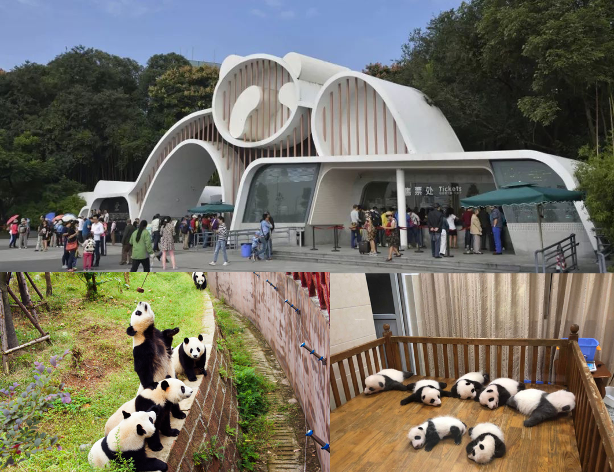

# Chengdu

### Research Base of Giant Panda Breeding

    

- Home to over 180 pandas. 
- Approximately 10 km from the center of Chengdu (30 to 40 minutes by car). 
- Recommended visiting time is 2 to 4 hours.

***
