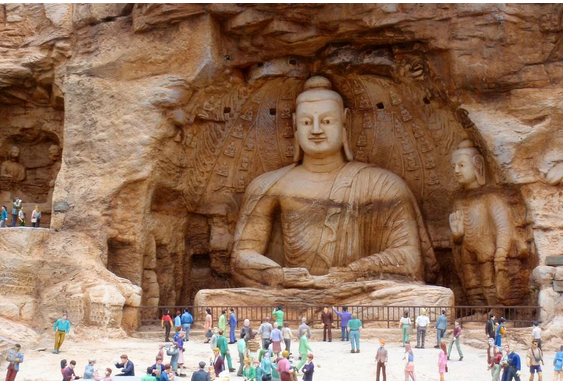
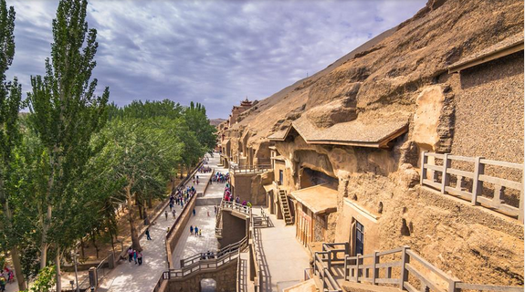
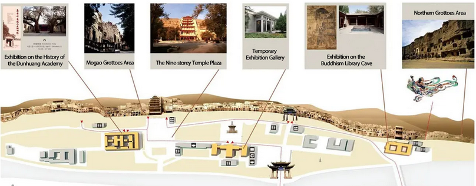
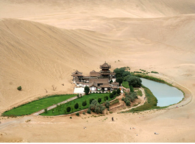
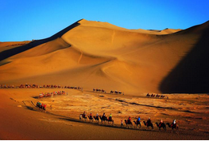

# Dunhuang

### Thousand Buddha Grottoes (Mogao Caves)

- A man-made wonder in the Gobi desert and brilliant treasure of Buddhist arts.
- Recommended visiting time is around 3 hours.

***

### Mingsha Mountain Crescent Lake Nature Park

- Stunning desert scenery and take part in exciting sand dunes activities
