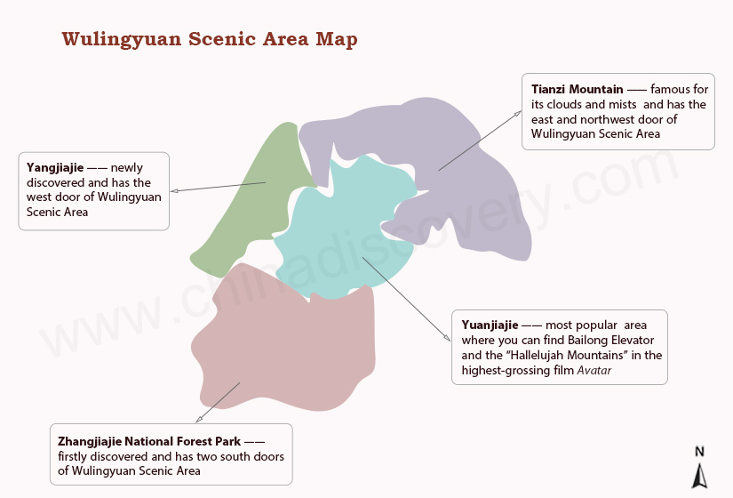
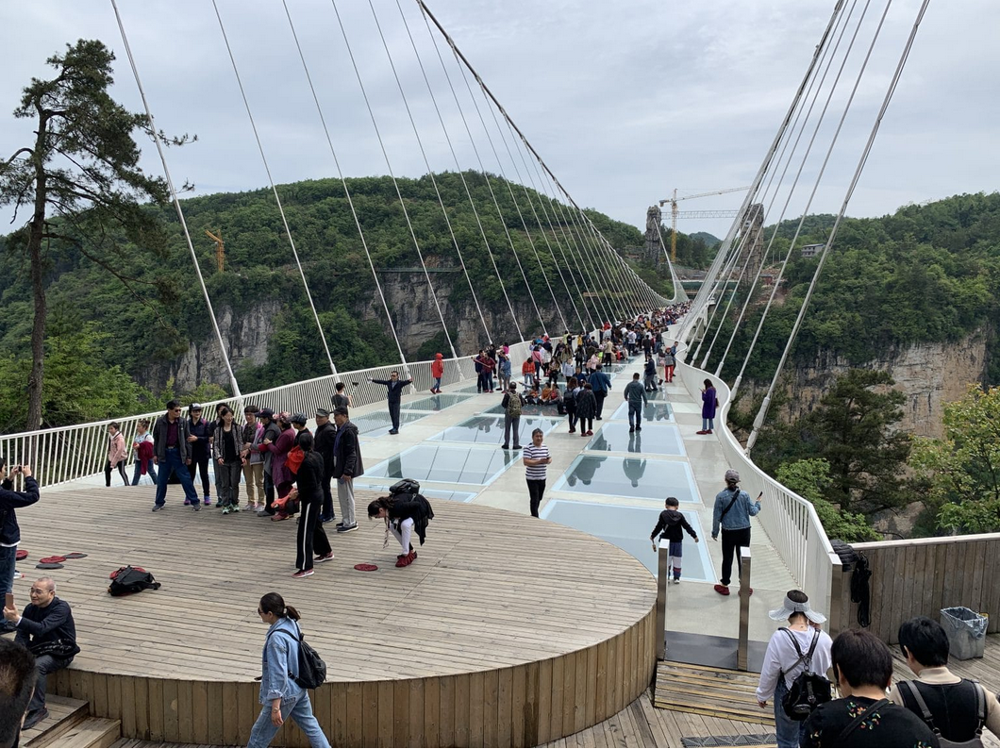
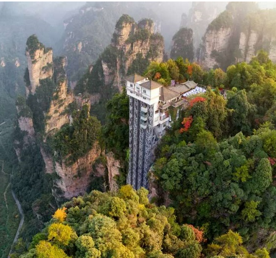
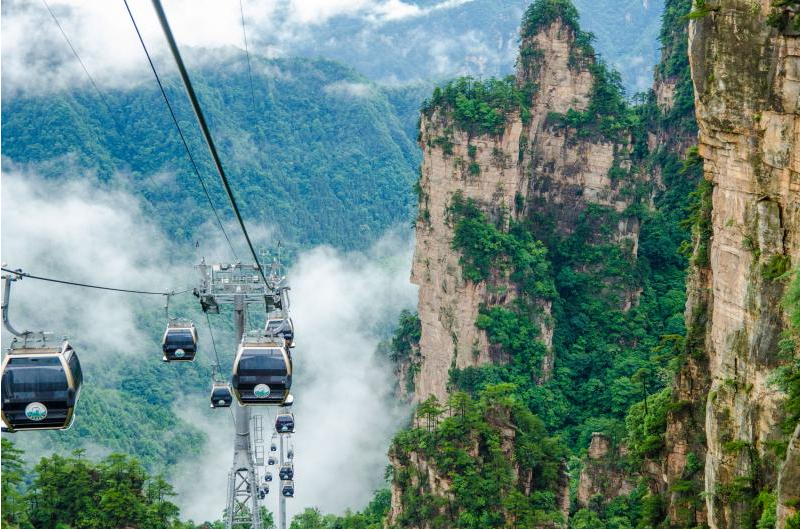
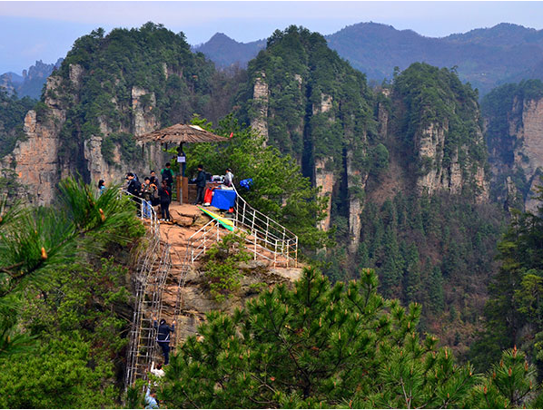

# Zhangjiajie

    

The Wulingyuan scenic area is divided into four parts:

- Zhangjiajie National Forest Park
- Yuanjiajie Scenic Area 
- Tianzi Mountain Nature Reserve
- Yangjiejie Scenic Area

***

### Zhangjiajie National Forest Park

    

- First national forest park in China, listed as UNESCO World Heritage Site in 1992.
- Recommended visiting time is 2 days.

***

### Yuanjiajie Scenic Area

    

- By Elevator, you’ll get up in 2 minutes. Alternatively, you can hike to the top.
- On the top, explore Yuanjiajie by visiting _Back Garden_, _Lost Soul Platform_, _Hallelujah Mountain_, _First Bridge under Heaven_ and more sights which takes about 2 hours.  

***

### Tianzi Mountain Nature Reserve

    

- Take the cable car up and down the mountain.
- Recommended visiting time is around 2 hours.

***

### Yangjiejie Scenic Area

    

- Notable highlights include _One Step To The Heaven_ (一步登天) and _Corridor in the Cliffs_ (空中走廊)
- Recommended visiting time is around 2 hours.

